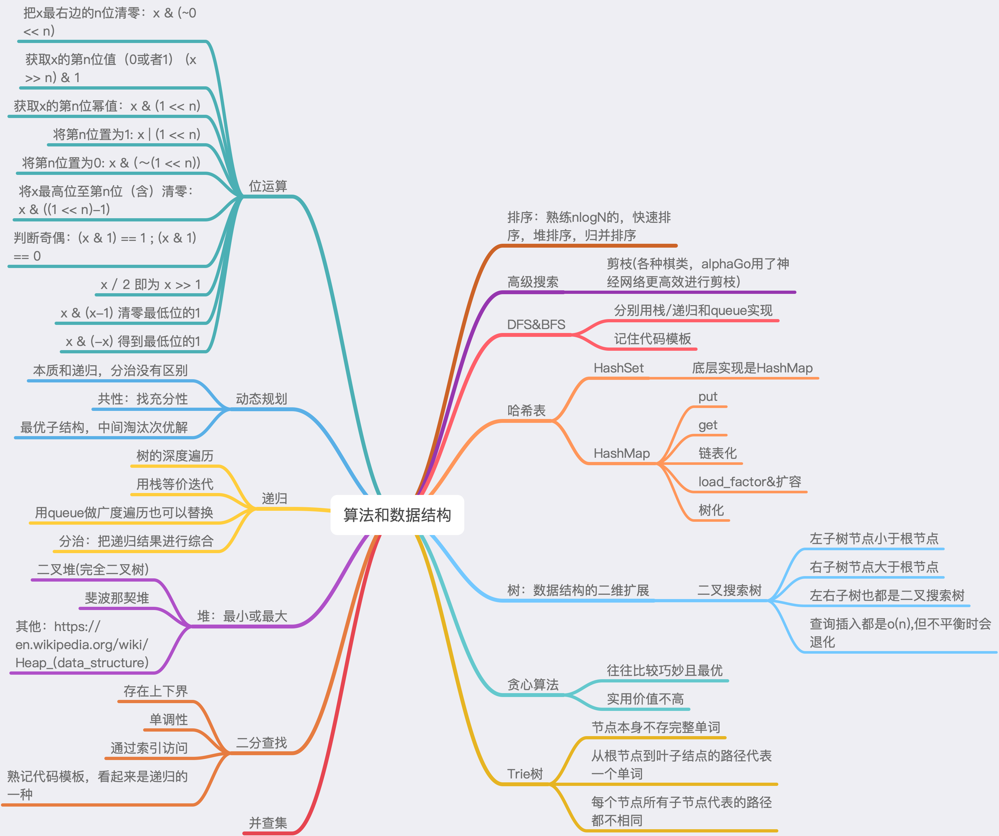

# 毕业总结

## 过去
从今年一月开始，我开始坚持每天投入2～3小时用于学习，涉略广泛，包含技术，商业，行业，趋势等等。随着认知的提高，10周以前，我开始意识到，一方面，现在的工作给我带来的能力增长已经不是很大，另一方面，自己需要全面提高技术的认知和能力，把自己推向领域内的Top 5%，甚至1%，以求得更为广阔的发展空间和更为自由的选择。

### 困境
作为非科班出身，算法与数据结构对我来说成了必须要啃下的一块硬骨头。入营摸底考试很认真做了，然而只得了50分，当时觉得，应该是来对了。刚开始训练营课程的时候，感觉很不得要领，容易对着题目发呆，却迟迟下不了手。进度很慢而时间却过得很快，第一周做题效率很低，最后也没完成几个题目。

即使如此，还是硬着头皮去写，去看官方题解，去看高票答案。令人欣慰的是，事情很快有了转机，第二周开始，感觉摸到了一些脉路，拿到题目思考一下，没有思路看答案，认真理解以后再回来刷，效率有了明显提高，二三两周刷的题目量都开始迅速增长。超哥反复强调的方法开始生效了。

### 技巧
纵观整个课程，最令我印象深刻的无疑是超哥的五毒神掌了。先前我也在其他培训课听过其他高手介绍自己的学习方法，当时印象并不深，这次算法班中，结合老师的五毒神掌，并加以实践，开始逐渐理解，学习这件事情，其实本质上可以分两个步骤。
1. 针对一个领域，首先是铺开来，整体学一遍资料，标记重点，再回过来反复。对应到算法班就是2倍速看超哥的视频，遇到关健重要的地方则放慢速度反复看直到理解。
2. 然后要开始刻意练习，针对这个领域的知识，进行实践，这当然就是超哥反复强调的五毒神掌刷题啦，反复刷题的过程就是一个反复加深，真正理解的过程。

### 内容
每周的学习内容可以看成是一个个的点，学习过程中用脑图把每周的要点记下来，10周结束以后，这已经是一个比较大的脑图了，这个脑图可以说是我知识体系的纲领，可以按图索骥，对着脑图看看自己各个部分的知识是否已经掌握，如果没有，就找到相应的内容再去复习，再去刷题。用脑图把一个个的知识点串联成一个整体，一个体系，算法的知识才真正属于自己。

## 现在

### 现状
10周的时间过得很快，整体而言，视频课的知识，加上一定量的刷题以及复习回顾，现在，算法题这种类型的编程开始显得比较娴熟，遇到了能够冷静分析，并且有了常用的，熟练的工具。能够分析场景的状态树，设法去剪枝，去寻找重复性，去寻找状态转移，总之就是对状态空间做文章。从考试的情况来看，整体也还马马虎虎，期中90分，期末95分。

但是，无论期中也好，期末也好，遇到的题目和训练过程中遇到的那些难题比起来，还是有不小的差距的。其实是在一个比较低的难度下取得了一个看似还可以的分数而已。自己的分量自己还是要清楚，实际上，这10周还是落下了不少比较复杂的题目没有刷，熟练度也没有达到得心应手的地步，很多难题可能还是会卡壳，刷题次数也还没有五毒神掌要求的那么多，leetcode中的AC题目个数还没到100个。以后还要不断努力。

### 行动
站在当前这个时间点，由于996甚至更长的工作时间，过去10周的学习整体还是有些力不从心。虽然取得了一定的成效，但是并没有达到我自己的预期。对于算法和数据结构已经有了一定的了解，但是熟练度和训练的广度都还不够。算法课已经结束了，接下来的日子里还需要对照着脑图时不时回来看看脑图和视频，温故一下那些知识点。坚持刷题，争取早日AC 300个。

## 未来
信息时代的冲击还没消化完，智能革命已经敲门，行业会再一次迎来大洗牌。吴军老师在《智能时代》中说，未来属于2%的人，成为他们，或者被他们淘汰。学习能力是一个人的核心竞争力，在掌握了学习的技巧后，不断摄取知识，在产业升级的大潮下，迎头赶上。当然，首先得设法取回一些自己的时间啊。。。